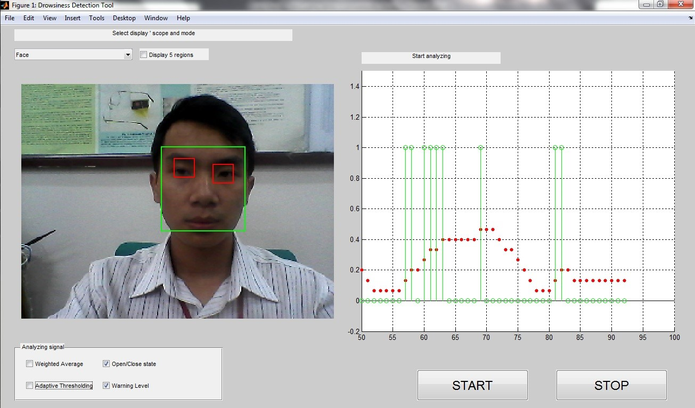

# Drowsiness Detection System
A simple software detecting user's drowsiness level by tracking eye activities. 

There are 4 main stages:
1. Face Detection - AdaBoost
2. Eyes Localization - Random Forest
3. Eye state monitoring - Various image processing techniques (global thresholding and image dilation)
4. Drowsines Detection - Automatic threshold selection

The program was primarily implemented in MATLAB, some parts in C/C++ (mex file) to boost up the performance.

To starts the program, simply run DrowsinessDetectionGUI.m or simply type on command line:
    >> DrowsinessDetectionGUI
    
Click [here](https://youtu.be/YsL4wMvDNgI) to watch the demo video.

## Some results:

Random foreset enables segmentation of facial regions without their prior detailed discription.

Graphical User Interface: green graph indicates the eye stat (0 - open, 1 - closed); the red one level of drowsiness.

## References
[1]	P. J. Viola, M., "Rapid Object Detection using a Boosted Cascade of Simple Features " Computer Vision and Pattern Recognition, 2001. CVPR 2001. Proceedings of the 2001 IEEE Computer Society Conference on	vol. 1, pp. I-511 - I-518 vol.1, 2001.

[2]	A. a. S. Criminisi, J. and Konukoglu, E., "Decision Forests for Classification, Regression, Density Estimation, Manifold Learning and Semi-Supervised Learning.," Microsoft Research2011.

[3]	C. A. Perez, A. Palma, C. A. Holzmann, and C. Pena, "Face and eye tracking algorithm based on digital image processing," in Systems, Man, and Cybernetics, 2001 IEEE International Conference on, 2001, pp. 1178-1183 vol.2.
